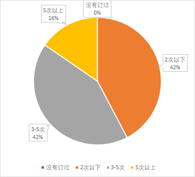
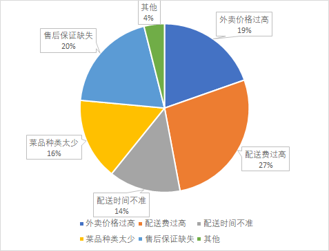

# 外卖类软件使用情况问卷分析

为了证明拼单的合理性和应用的广泛性，我们对外卖类软件的使用情况进行了问卷调查。本次调查问卷的发放途径主要是：微信朋友圈和讨论组，总计共收到26份有效问卷，其中男性14人，女性12人。因为接受调查问卷的人群主要是小组成员的在校同学，正是本软件的目标人群，所以可以认为，本次的调查结果具有一定代表性，可以反映出现存外卖软件运营方式上存在的一些问题。

首先，我们调查了外卖类软件在校园内的普及性。在我们的调查中（如图1），几乎没有在校学生从来没有订外卖的经历，而且绝大多数学生，订外卖的频率都比较高，其中有接近15%的调查对象基本每天都要订外卖，由此可见，外卖类软件在高校内有很高的普及性，大部分学生都养成了吃外卖的习惯。因此，只要我们提出的新的外卖模式在某一方面具有优势，那么就一定会有广阔的应用市场。

图1 外卖类软件使用频率

接着，我们试图找出影响外卖体验的主要因素。根据结果(如图2)，我们发现“配送费”这一因素在订外卖的体验中占主要影响作用。超过一半的调查对象认为外卖配送费过高，配送费甚至达到了外卖本身费用的20%以上。既然这么多人觉得配送费不合理，那么，只有能解决配送费过高的问题，就肯定能吸引一大批人来使用我们的服务。

图2 影响外卖类软件使用体验的主要因素

最后，我们对“拼单”这一行为的接受程度做了调查。结果和预想的一样，绝大多数同学能接受“拼单”这一行为，并有超过一半的同学已经尝试过拼单。这说明在未来软件的推广过程中，人们对这种运行模式的接受程度较高、没有明显阻力。

基于这份问卷，我们可以得出以下观点：在高校内，外卖类软件的普及性很高，且在使用过程中，大多数人都觉得现在的配送费过高，针对我们提出的用拼单来抵消配送费的方案，绝大多数人都愿意尝试。而且，和同为团购类软件拼多多相比，我们的软件只针对在校学生进行服务，所以可以避免出现产品质量不合格、服务差（这是拼多多最主要的问题）的情况发生。因此，我们认为提出的解决方案能覆盖多数人的痛点，在未来的推广中，也不会存在什么阻力，所以可以认为此方案具有广阔的应用前景、值得尝试。	

## 附件：关于外卖类软件的使用调查问卷

1、你使用外卖或其他即时配送购物软件（如每日优鲜等）的频率(单选)：

| 选项             | 小计 |
| ---------------- | ---- |
| 每周2次或以下    | 11   |
| 每周3-5次        | 11   |
| 每周5次以上      | 4    |
| 本题有效填写人次 | 26   |

2、你使用过的即时配送购物软件有哪些(多选)：

| 选项             | 小计 |
| ---------------- | ---- |
| 饿了么           | 21   |
| 美团             | 21   |
| 每日优鲜         | 5    |
| 叮咚买菜         | 0    |
| 盒马生鲜         | 2    |
| 都未使用过       | 0    |
| 其他             | 4    |
| 本题有效填写人次 | 26   |

  

3、你在点外卖的时候，影响你做选择的因素有哪些(多选)：

| 选项             | 小计 |
| ---------------- | ---- |
| 商家评价         | 16   |
| 配送费           | 19   |
| 商品价格         | 23   |
| 配送时间         | 11   |
| 口味特点         | 19   |
| 其他             | 1    |
| 本题有效填写人次 | 26   |

  

4、你觉得目前外卖等软件有哪些需要改进的地方(多选)： 

| 选项             | 小计 |
| ---------------- | ---- |
| 外卖价格过贵     | 10   |
| 配送价格过高     | 14   |
| 配送时间不准     | 7    |
| 菜品种类太少     | 8    |
| 售后保障缺失     | 10   |
| 其他             | 2    |
| 本题有效填写人次 | 26   |

  

5、你每单外卖大约需要花多少钱(单选)：

| 选项               | 小计 |
| ------------------ | ---- |
| 0-10元             | 1    |
| 10-15元            | 5    |
| 15-20元            | 12   |
| 20-30元            | 7    |
| 30-50元            | 0    |
| 我点外卖从不看价格 | 1    |
| 本题有效填写人次   | 26   |

 

6、你每单需要付的配送费一般是多少(单选)： 

| 选项             | 小计 |
| ---------------- | ---- |
| 0-2              | 10   |
| 3-4              | 11   |
| 5-7              | 5    |
| 7以上            | 0    |
| 本题有效填写人次 | 26   |

 

7、你是否有过与朋友一起拼单的经历(单选)： 

| 选项             | 小计 |
| ---------------- | ---- |
| 有               | 15   |
| 没有             | 11   |
| 本题有效填写人次 | 26   |

 

8、你是否愿意与朋友一起下单来平摊配送费(单选)：

| 选项               | 小计 |
| ------------------ | ---- |
| 是                 | 19   |
| 否                 | 1    |
| 我没考虑过这种情况 | 2    |
| 视具体条件而言     | 4    |
| 本题有效填写人次   | 26   |
